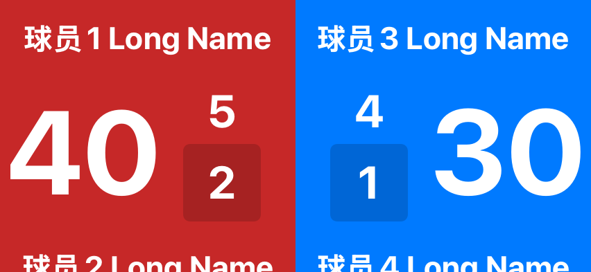
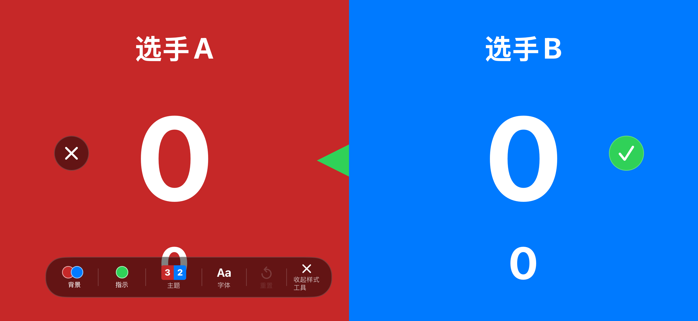

# iOS 计分板、样式编辑与显示端对齐检查（2026-09-13）

**结论：未通过。不能认定已与 Android / HarmonyOS 对齐，也不能认定手表功能已彻底删除。**

> 这是修复前的历史检查结论。2026-09-14 已执行修复，当前结果见 [修复验收报告](ios_display_parity_remediation_2026-09-14.md)。原始问题和失败证据保留。

基线为 `main / e6c27d5` 加本次开始时已有的未提交改动。没有覆盖或撤销这些改动。开始时的差异备份位于 `build/audit-2026-09-13/baseline.patch`。

## 检查方式与证据边界

- 原生 SwiftUI 使用 XCUITest 操作模拟器，检查计分板、编辑入口、菜单、样式入口；不把浏览器截图当成原生 App 验收。Selenium 不能直接操作本项目的 SwiftUI 控件。
- 28 个主目录项目逐项遍历 iPhone / iPad。iPhone 修正截图方向后重新遍历；iPad 首轮截图失真，仅计入入口遍历，不作为像素布局通过证据。四类球的双打编辑，以及斗地主、UNO、多人计分的独立编辑专项复验通过。
- 显示端：33 个精确 gameType × 3 个视口（852×393、1194×834、393×852）× 投屏/跨设备显示 × 1x/1.5x/2x，生成 **594 张生产渲染器图片**（1x、1.5x 为正常设置范围；2x 仅为压力场景）。输入为合成比赛快照，包含长名称、局盘分；这验证的是渲染，不是实际 AirPlay 或云房间传输。
- 样式面板额外通过生产组件直接注入编辑状态，使用 UIKit 承载滚动内容，取得 28 个 styleID × 背景/主题/字体/元素面板的 **112 张组件图片**（`panel-hosted.xcresult`）。直接注入仅用于看到无法从正常点击进入的面板，不能算该交互已经通过。
- 与相邻 `jifen-android`、`jifen-hos` 当前源码对照；没有把旧报告里的“对齐”当成证据。Android / HarmonyOS 本轮没有构建或跑设备 UI，不能声称三端像素级实机对齐。
- 在 Node 中执行从当前鸿蒙源码原样提取的样式校验函数，输入由 iOS 实际编码器生成的 JSON，另设有效 V2 数据对照。
- **未执行真实设备投屏、三端真实云房间互联、断网重连或发布提审。**

## 确认的问题

共 **14 项：8 项 P1、6 项 P2**。关键证据另存于 [持久证据目录](audits/2026-09-13/evidence)，完整 908 张分类图库位于 build 下（202 张本机操作、112 张面板组件、594 张显示端渲染）。

### F01 · P1 · Watch App 已删，手机手表功能仍在启动

- Xcode 目标现在只有 `jifen / jifenTests / jifenUITests`，Watch App、其测试目录及手表设置页面已删除。
- 但 `jifenApp` 仍创建并注入 `PhoneWatchLinkService`；初始化执行 `transport.activate()`，恢复联动上下文，注册消息、记录、常用名称回传和重试任务。
- 构建出的 App 动态库仍链接 **WatchConnectivity.framework**。`JifenWatchLinkEntryEnabled` 仍可从 Info.plist 重新打开；Rally、网球、射箭、黑八、追分、斯诺克等仍保留手表会话、只读锁、接管和同步路径。
- 这是实际功能残留，不是只有历史注释。当前要求应保持 Watch 删除方向，不能按旧验收报告继续补手表功能。

证据：[App 初始化](../jifen/jifenApp.swift#L104)、[服务激活](../jifen/Core/Link/PhoneWatchLinkService.swift#L268)、[可重启开关](../jifen/Core/AppFeatureFlags.swift#L25)。构建取证：`project-targets.json`、`watch-linked-framework.txt`。

清理范围：手机联动服务/入口/会话控制及专用测试、构建依赖、可重启开关。历史记录的来源字段应保留兼容，避免把旧数据解析当成活跃手表功能删除。

### F02 · P1 · 新版样式编辑无法点选文字，字号/文字色面板不可达

实际点击计分数字后没有出现字号滑杆。源码全量检索确认 `styleElementSelectable` **只有定义，没有任何计分板调用**。同时编辑环境只注入 overlay，没有传给底层计分文字；顶层透明整屏点击层还吞掉底层点击。

影响使用新版编辑器的全部项目。能打开“样式与颜色”工具条，不等于能编辑主分、姓名、局分、盘分的字号和颜色。

证据：[元素选择器](../jifen/Features/Scoreboard/Shared/ScoreboardStyleEditOverlay.swift#L79)、[拦截层](../jifen/Features/Scoreboard/Shared/ScoreboardStyleEditOverlay.swift#L231)、[环境注入位置](../jifen/Features/Scoreboard/Shared/ScoreboardStyleEditOverlay.swift#L1645)。截图：`audit_pingpong_04_style / 05_text_panel`。

### F03 · P1 · iOS 发出的字号样式被 Android / HarmonyOS 丢弃

`encodeAppearance` 只发 `style.fontSizeMultipliers`，没有 V2 的 `version`、`themeCode`、`fontCode`、`panels`、`elements`、`serverIndicatorColor`、`styleRevision`。

- Android `mapToDisplayStyleSnapshotV2` 首先要求 `version == 2`。
- HarmonyOS 除版本外还要求完整字段及至少一个有效 panel。
- 实测：iOS 实际输出 `iosAccepted: false`，有效 V2 对照 `validControlAccepted: true`。

所以 iOS → Android/HarmonyOS 的字号倍率、逐元素样式不会按预期落到显示端。仅测 iOS 自己的 JSON 往返不能发现此问题。

证据：[编码器](../jifen/Core/CloudSync/DisplayStateWireCodec.swift#L100)、[Android 校验](../../jifen-android/app/src/main/java/com/douhua/jifen/display/model/DisplayState.kt#L653)、[鸿蒙校验](../../jifen-hos/entry/src/main/ets/scoreboard/display/DisplayState.ts#L350)。取证：`hos-style-validation.json`、`range-images/audit-ios-outgoing-wire.json`。

### F04 · P1 · iOS 接收 V2 样式时丢主题、字体和逐元素颜色

接收端只读取旧的扁平 appearance 字段和嵌套倍率，没有读取 V2 的主题/字体、panels、elements、发球指示色。有效 V2 输入中电子屏主题、sports 字体、左右独立色，解码后变为 default/default/默认底色/白字。

反方向发送也将左右独立主分色压成一个 `scoreColor`，右侧独立颜色不能往返保留。

证据：[解码器](../jifen/Core/CloudSync/DisplayStateWireCodec.swift#L290)、`range-images/audit-ios-incoming-wire.json`。

### F05 · P1 · 多人格子显示端忽略字号倍率

`DisplayMultiGridSurface` 只用 cellWidth/cellHeight 推导字号，没有使用 `appearance.fontSizeMultipliers`。UNO、多人计分、斗地主，以及 3/4 人追分的格子布局受影响。UNO、多人计分在同视口的 1x/1.5x 图片逐像素完全一致；斗地主亦相同（`grid-multiplier-comparison.json`）。

Android 同类模型明确读取 mainScore/playerName 倍率，并有同步端名称缩放、密集列数缩放、斗地主与追分专属系数；iOS 也没有对应这些细节。

证据：[iOS 格子字号](../jifen/Features/Display/ScoreboardExternalDisplayView.swift#L2113)、[Android 格子倍率](../../jifen-android/app/src/main/java/com/douhua/jifen/display/ui/DisplaySurfaceModels.kt#L1215)。截图：`range-images/display_uno_tablet_sync_1x.png / display_uno_tablet_sync_1.5x.png`。

### F06 · P1 · 双打底部姓名被裁切

正常上限 1.5x、852×393 横屏下，网球双打和板式网球底部姓名被裁掉一半。上下名字行和中间留白的固定高度已经合计为整屏高度，又给上下行各增加垂直 padding，超出视口后被外层 `.clipped()` 裁掉。乒乓球、羽毛球、匹克球双打及桌上足球双打的相近路径有同类高度预算风险，2x 压力场景出现明显裁切；不能把这些 2x 结果表述为正常设置必现。

证据：[名称行高度与 padding](../jifen/Features/Display/ScoreboardExternalDisplayView.swift#L1891)。截图：`range-images/display_tennis_doubles_phone_sync_1.5x.png`、`range-images/display_padel_phone_sync_1.5x.png`；其他双打的 2x 图仅作压力参考。

### F07 · P1 · 网球双打/板式网球在窄竖屏缺主分

393×852 视口下，固定中间统计组宽度加间距耗尽每半屏可用宽度，15/30/40 主分被压没，只剩局分/盘分。右方长名字也会横向裁切。这个场景可出现在同步端使用竖向状态或窄窗口。

单打网球/软式网球同视口虽然仍有主分，但整体缩得很小，阅读性不足。不能仅检查横屏大屏后判定通过。

证据：[固定网球统计组](../jifen/Features/Display/ScoreboardExternalDisplayView.swift#L1982)。截图：`display_tennis_doubles_portrait_sync_1x`、`display_padel_portrait_sync_1x`。

### F08 · P1 · 跨设备显示完赛后没有退出入口

`RemoteDisplayView` 在 `.finished` 下既不显示返回按钮，也不响应点屏唤出；完赛内容仍是 `ScoreboardExternalLiveView`，结果浮层只有文字，没有退出回调。Android 向显示表面传入 `DisplayControls(onExit=...)`，iOS 没有等价接入。

证据：[完赛渲染](../jifen/Features/Display/RemoteDisplayView.swift#L104)、[返回条件](../jifen/Features/Display/RemoteDisplayView.swift#L258)、[禁止唤出](../jifen/Features/Display/RemoteDisplayView.swift#L290)、[纯文字结果层](../jifen/Features/Display/ScoreboardExternalDisplayView.swift#L1230)。本项为完整控制流核查，尚未用真实云房间复现。

### F09 · P2 · 官方休息态不从 iOS 发往其他显示端

编码器明确省略 `rest`。本机投屏可显示休息遮罩，远端却缺失，因而局间休息等状态的页面不一致。当前测试只证明本地倒计时投影，不证明 wire 已传输。

证据：[省略 rest](../jifen/Core/CloudSync/DisplayStateWireCodec.swift#L43)。带休息态的实测 outgoing JSON 中也没有 rest。

### F10 · P2 · 样式编辑确认/退出按钮放在主分中线

名称是 `topControls`，实际却直接放在默认居中的 ZStack 内，没有顶部对齐；截图中叉号和对勾横跨主分区域。展开工具条也偏左，盖住局分。这是产品布局问题，与截图采集失真无关。

证据：[topControls 的放置](../jifen/Features/Scoreboard/Shared/ScoreboardStyleEditOverlay.swift#L236)。截图：`audit_pingpong_07_palette`。

### F11 · P2 · 多人场地 team_court 布局没有 iOS 显示模板

鸿蒙显示协议已有 `team_court`；iOS layout 枚举没有该值，接收到此布局静默回退成 twoSide；嵌套对象型 `teamCourtPlayers` 也不属于 `ScoreboardDisplayValue` 可表达的类型。只能保留两侧比分，无法完整对应多人场地人员布局。

证据：[iOS 枚举](../jifen/Core/Display/ScoreboardDisplayState.swift#L8)、[回退](../jifen/Core/CloudSync/DisplayStateWireCodec.swift#L198)、[鸿蒙布局定义](../../jifen-hos/entry/src/main/ets/scoreboard/display/DisplayState.ts#L11)。属于源码确认的协议覆盖缺口，未做该模式真机收发。

### F12 · P2 · 网球系列本机编辑页的局分/盘分标签只剩半边

网球、软式网球和板式网球实际编辑截图中，中线只剩被截断的“局/盘”标签。标签放在左半屏的 VStack 内再向右 offset 到中线，右半屏随后绘制并盖住越界部分。应由共同父层布局中线标签，不能靠左半屏文字越界绘制。

证据：[半屏绘制顺序](../jifen/Features/Scoreboard/Sports/Tennis/TennisScoreboardView.swift#L217)、[局盘分标签偏移](../jifen/Features/Scoreboard/Sports/Tennis/TennisScoreboardView.swift#L700)、[文字 offset](../jifen/Features/Scoreboard/Sports/Tennis/TennisScoreboardView.swift#L973)。截图：`ui-final-images/iPhone_audit_tennis_02_edit.png`，同目录 `padel / soft_tennis`。

### F13 · P2 · 样式使用提示关闭后仍会再次出现

关闭提示写入 Bool `true`，打开时却用 `string(forKey:) != "true"` 判断。Foundation 实测 Bool 的字符串读取结果为 `"1"`，因此再次打开仍满足显示条件。提示会重复挡住样式编辑页。

证据：[读取](../jifen/Features/Scoreboard/Shared/ScoreboardStyleEditOverlay.swift#L259)、[写入](../jifen/Features/Scoreboard/Shared/ScoreboardStyleEditOverlay.swift#L1416)、`style-hint-storage.txt`。

### F14 · P2 · 同步端顶部信息条与长队名重叠

1.5x 正常上限时，篮球无实时时钟的“第 1 节”与拳击“第 1 回合”徽标压在长队名行上。同步分支把 sportInfoTopInset 清零，内容区只留标题高度，宿主又把徽标放回靠近顶部的位置，没有为放大后的两行名称避让。该结果由合成状态经过生产渲染器复现；真实时钟、节次与犯规组合仍需后续联网验收。

证据：[同步端 inset](../jifen/Features/Display/ScoreboardExternalDisplayView.swift#L650)、[徽标定位](../jifen/Features/Display/ScoreboardExternalDisplayView.swift#L1289)。截图：`range-images/display_basketball_phone_sync_1.5x.png`、`display_boxing_phone_sync_1.5x.png`。

## 逐项目结果

“已查看”只表示页面已检查，不表示全部功能通过。新版样式项目均受 F02/F10/F13 影响；所有跨设备项目还共同受 F03/F04/F08 影响。

| 项目 | 本机/编辑检查方式 | 样式面板 | 投屏/同步端专项结论 |
|---|---|---|---|
| 乒乓球 | 单打及双打实际进入 | 新版，元素点选不可达 | 双打 F06；官方休息 F09 |
| 羽毛球 | 单打及双打实际进入 | 新版，元素点选不可达 | 双打 F06；多人场地 F11；休息 F09 |
| 网球 | 单打及双打实际进入，标签 F12 | 新版，元素点选不可达 | 双打 F06/F07；休息 F09 |
| 匹克球 | 单打及双打实际进入 | 新版，元素点选不可达 | 双打 F06；休息 F09 |
| 毽球 | 目录进入、编辑查看 | 新版，元素点选不可达 | 多人场地 F11；默认两侧模板已渲染 |
| 壁球 | 目录进入、编辑查看 | 新版，元素点选不可达 | 默认两侧模板已渲染 |
| 软式网球 | 目录进入、编辑标签 F12 | 新版，元素点选不可达 | 窄竖屏比分过小，F07 相关 |
| 板式网球 | 目录进入、编辑标签 F12 | 新版，元素点选不可达 | F06/F07 |
| 足球 | 目录进入、编辑查看 | 新版，元素点选不可达 | 基础渲染已查看；阶段/补时需真实状态互联 |
| 五人制足球 | 目录进入、编辑查看 | 新版，元素点选不可达 | 基础渲染已查看；阶段/补时需真实状态互联 |
| 篮球 | 目录进入、编辑查看 | 旧版显示设置，与安卓范围一致 | 顶部信息 F14；真实节次/犯规组合尚未完整验收 |
| 三人篮球 | 目录进入、编辑查看 | 旧版显示设置，与安卓范围一致 | 基础渲染已看；真实犯规组合状态尚未完整验收 |
| 排球 | 目录进入、编辑查看 | 新版，元素点选不可达 | 两侧主分/局分渲染已查看 |
| 沙滩排球 | 目录进入、编辑查看 | 新版，元素点选不可达 | 两侧主分/局分渲染已查看 |
| 气排球 | 目录进入、编辑查看 | 新版，元素点选不可达 | 两侧主分/局分渲染已查看 |
| 射箭 | 目录进入、编辑查看 | 新版，元素点选不可达 | 基础主分/局分已查看；箭次弹窗不是显示端交互 |
| 拳击 | 目录进入、编辑查看 | 新版，元素点选不可达 | 顶部回合 F14；真实回合组合尚未完整验收 |
| 台球 | 目录进入、编辑查看 | 新版，元素点选不可达 | 两侧主分渲染已查看 |
| 黑八 | 目录进入、编辑查看 | 新版，元素点选不可达 | 两侧主分渲染已查看 |
| 九球追分 | 默认设置进入、编辑查看 | 旧版，与安卓范围一致 | 2 人两侧模板已看；3/4 人格子路径 F05 |
| 斯诺克 | 目录进入、编辑查看 | 新版，含 matchTitle，但点选不可达 | 基础主分/单杆已看；抬头的字号编辑受 F02 |
| 斗地主 | 独立右上编辑入口补验 | 新版，元素点选不可达 | 三人格子倍率 F05 |
| 掼蛋 | 目录进入、编辑查看 | 新版，元素点选不可达 | 两侧卡牌模板已渲染；牌级特殊状态非本轮完整规则验收 |
| 升级 | 目录进入、编辑查看 | 新版，元素点选不可达 | 两侧卡牌模板已渲染 |
| UNO | 长按玩家名称进入编辑，通过 | 旧版，与安卓范围一致 | F05 |
| 桌上足球 | 目录进入、编辑查看 | 新版，元素点选不可达 | 双打显示模板 F06；双打本机全操作未完整跑 |
| 简单计分 | 目录进入、编辑查看 | 新版，元素点选不可达 | 两侧模板已渲染 |
| 多人计分 | 长按玩家名称进入编辑，通过 | 旧版，与安卓范围一致 | F05；尚未逐人数覆盖 2–10 人的所有操作 |

项目范围还存在一项明确差异：Android、HarmonyOS 当前目录/模型含麻将，iOS 本轮的 28 项目录没有麻将。这是待确认的产品范围差异，不在本轮擅自新增麻将实现。手表项目全部排除在功能补齐范围之外。

## 已对齐的部分

- 大部分主目录项目、单双打 styleID 独立范围以及新版/旧版样式编辑器适用范围一致。
- iOS 与 Android 的基础显示系数一致：chrome 为短边/360，限制 1–1.5；同步名称从 0.78 到 0.90；本机扩展屏次级分数按高度与半宽共同放大到 2；双打名称使用 `1 + (secondary - 1) × 0.7`。
- 本机投屏有意使用独立视口字号、不直接套用手机字号倍率，这与 Android 的 `takeUnless { isLocalProjection }` 一致。不能把投屏 1x/2x 图片相同一律判成缺陷。**同步格子端不使用倍率才是 F05。**
- 样式配置的保存、取消、重置、项目隔离，目录覆盖及基础显示模型单测通过；这些通过不覆盖 F02 的真实点击接入，也不覆盖真实网络。

## 验证记录与遗留边界

- iOS Simulator `build-for-testing` 成功，最终构建不含 Watch target，但仍链接 WatchConnectivity（F01）。
- 显示、目录、样式、Typography/本地快照相关测试 **164 项通过**；后续显示倍率/协议取证 2 项、特殊编辑及调色板专项 1 项均通过（`range-and-edit.log`），四类双打编辑专项通过（`supplement.log` 对应用例）。
- 首轮 UI 遍历完成后有测试失败：包括统一查找编辑按钮误判网球/斗地主/UNO/多人计分，以及把旧版显示设置误判为缺少新版编辑器。最终全目录遍历仍记录斗地主/UNO/多人计分三个脚本定位失败；它们均已在专项中按实际入口补验通过。没有将整轮 UI 遍历标记为全绿，也不把脚本失败数当作产品缺陷数。
- 修正了原有截图工具把已包含方向信息的 UIImage 尺寸再次交换，导致横屏截图被拉伸成竖图的问题。修正后的原生截图单独保存；首轮失真图片只留作原始记录。
- 本轮新增审查脚本/快照用例、修正截图方向工具并编写本报告；**F01–F14 尚未修改业务实现，需修复后重新验收**。没有恢复手表功能，没有进行线上部署或提审。

## 证据入口

- 可筛选逐项目图库位于本地生成目录 `build/audit-2026-09-13/index.html`（不随仓库提交），可按项目、页面类型和倍率筛选。
- `ui-final.xcresult`：28 项目录实际遍历；`range-and-edit.xcresult`：正常倍率及特殊编辑复验。
- `display-final.xcresult`：164 项相关单测；`supplement.xcresult`：双打编辑通过、特殊编辑首次定位失败的原始记录。
- 112 张面板组件宿主渲染通过（`panel-hosted.log`）。ImageRenderer 无法完整绘制这些滚动面板，早期空面板取证未计入最终图库。
- 图库不包含首轮拉伸失真的原生截图。直接面板渲染与原生操作截图分开标注。

修复顺序建议：先 F01/F02，补齐完整 V2 收发 F03/F04，再处理 F05–F08，最后收口休息态、多人场地及编辑器摆位。修复后的验收必须补上真实控制端→显示端的样式变更、取消恢复、完赛退出与换向，不只检查静态图片。

### 代表性截图

网球双打，852×393 同步显示、正常上限 1.5x：底部姓名被裁切。

样式工具展开后，确认/退出按钮停在主分中线，工具条遮盖局分。

