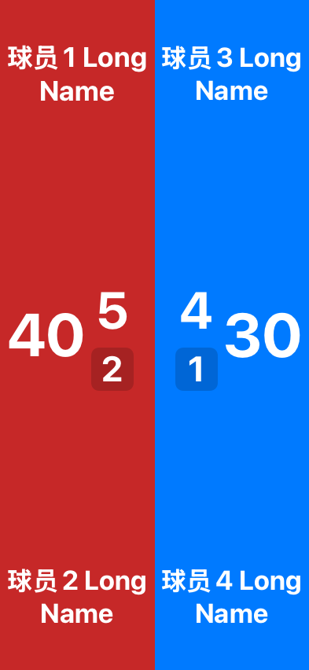
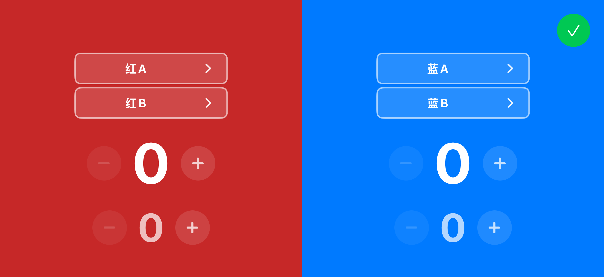

# iOS 计分板与显示端修复验收（2026-09-14）

> 用户随后提供的 14 张截图及新增标准已完成[二次复核与补修](ios_display_followup_2026-09-14.md)。下文保留上一轮验收记录；最新截图、仅横屏测试范围及修复结论以补修报告为准。

本轮按用户确认执行：**iOS 手表功能保持删除，并彻底清理手机侧联动实现；按 Android / HarmonyOS 现有规则修复原报告 F01–F14。** 修复已落到代码。模拟器、生产渲染器和协议校验的结论见下表；真实 AirPlay 和三端云房间联调尚未执行，不将本报告表述为三端实机验收通过。

基线仍是 `main / e6c27d5` 加工作区原有改动。本次开始前保存了逐文件备份和差异：`build/remediation-2026-09-14/backup-path.txt`、`baseline.patch`。未撤销原有修改，未提交、发布或提审。

## 原问题逐项处理

| 编号 | 修复结果 | 本轮验证 |
|---|---|---|
| F01 | 删除手机 Watch 服务、传输/重试、会话接管、手表入口和引导、可重启开关、专用共享模块与测试、工程引用。移除球类接收手表状态的未调用接口。 | 源码残留扫描；Xcode 仅手机及测试目标；最终 App 不链接 WatchConnectivity；本地记分/恢复/记录测试通过。 |
| F02 | 编辑环境传到底层文字，接入主分、姓名、局盘分、标题点选，移除吞点击的整屏透明层，修正父容器的无障碍分组。 | 主目录逐项原生点击；四类双打姓名/主分/局盘分专项。射箭中间操作层单独修复、复验。 |
| F03 | 输出完整 V2 样式，保留旧扁平字段兼容：版本、主题、字体、全部元素倍率、面板、逐元素颜色、发球色和修订号。 | iOS 实际 JSON 输入鸿蒙原始校验函数，样式通过；旧不完整格式对照仍被拒绝。 |
| F04 | 解析 V2 主题、字体、面板、逐元素色；保留两侧独立颜色，按队伍 ID 解析换边后的样式。 | 收发单测；透明色 RGBA/ARGB 往返；digital/teko/seven_segment 编码；双打次级分颜色实际像素测试。 |
| F05 | UNO、多人、斗地主和追分格子显示应用姓名/主分倍率，字号受单元格实际宽高限制。 | 生产渲染器 1x/1.5x 对照；斗地主名称与主分分配独立高度，避免大字重叠。 |
| F06 | 双打姓名行的 padding 计入行高，底部姓名留在视口内。 | 六类双打显示模板在手机横屏、平板及窄竖屏渲染，含 1.5x 正常上限。 |
| F07 | 网球双打、板式网球按半屏可用宽度分配主分与局盘分；单打网球名称另设高度上限。 | 393×852 主分保持可见；852×393 长名称与中心分数不再重叠。 |
| F08 | 完赛结果层提供“退出显示”，连接 RemoteDisplayView 的停止会话与 dismiss。 | 完整控制流核查；真实云房间完赛点击仍在设备联调范围。 |
| F09 | 编解码官方休息态，映射 countdown/prepare、毫秒倒计时、准备秒数、afterAction 与 revision。 | 倒计时/准备态单测；实际 outgoing 的 rest 通过鸿蒙原始校验。 |
| F10 | 确认/退出置顶，展开工具条居中靠底。 | 原生样式编辑和面板截图；不再停在比分中线。 |
| F11 | 增加 team_court 模板，显示六名队员及两队主分/局分。 | 布局枚举与 wire 往返单测、六人窄竖屏渲染。 |
| F12 | 网球编辑时调整半屏绘制层级，跨中线的局分/盘分标签完整可见。 | 网球、软式网球、板式网球编辑页原生截图。 |
| F13 | 使用提示按 Bool 读取，关闭后不重复弹出。 | 每个新版样式项目退出后重新进入，断言提示不再出现。 |
| F14 | 同步显示也为顶部信息条预留空间。 | 篮球/拳击长队名、正常最大倍率图片复验。 |

**对原报告 F11 的纠正：**当前鸿蒙 `teamCourtPlayers` 实际为字符串数组，并非必须扩展为嵌套对象。真正缺口是 iOS 缺少 team_court 布局模板，本轮按实际协议实现数组方案。

## 回归中新发现并处理的细节

- 七种元素字号分别保存、预览、取消和恢复；修改盘分不再连带修改局分或标题。旧三档排版设置继续兼容。
- 修复编辑会话中对同一 Swift 状态同时读写的独占访问冲突，采用副本修改后一次写回。
- 双打显示统一读取对应的 `setGameScore` 元素；未使用的 `setScore` / `gameScore` 默认颜色不再覆盖其颜色。测试从实际 wire 解码到生产渲染器，检查指定颜色存在且放大后的像素面积增长。
- 桌上足球双打编辑按两行姓名输入框的实际高度重新分配空间，底部局分恢复完整显示；对应姓名和次级分也连接正确的双打元素。
- 样式编辑期间停止普通记分手势、射箭弹出计分，以及台球/卡牌附加记分按钮，避免改样式时误操作比赛。
- 发送端将样式面板投影到实际屏幕侧，保留队伍绑定；交换左右后背景和各元素色随队伍移动。

## 逐项目覆盖

“本机”指 XCUITest 原生操作与截图，不是网页模拟。“显示”指生产 SwiftUI 渲染器加合成比赛快照。旧版样式设置的适用范围保持与 Android 当前实现一致。

| 项目 | 本机计分板 / 编辑 / 样式 | 投屏与同步显示 |
|---|---|---|
| 乒乓球 | 单打全流程；双打姓名、主分、局盘分专项 | 单打/双打，全尺寸倍率矩阵 |
| 羽毛球 | 单打全流程；双打专项 | 单打/双打矩阵，另测 team_court |
| 网球 | 单打全流程；双打专项；局盘标签复看 | 单打/双打矩阵，重点窄屏与长名称 |
| 匹克球 | 单打全流程；双打专项 | 单打/双打矩阵 |
| 毽球 | 全流程，含当前默认双人队伍编辑 | 基础矩阵；六人场地模板另测 |
| 壁球 | 全流程 | 全尺寸倍率矩阵 |
| 软式网球 | 全流程，局盘标签复看 | 全尺寸倍率矩阵 |
| 板式网球 | 全流程，双打姓名与局盘分 | 全尺寸倍率矩阵 |
| 足球 / 五人制足球 | 各自全流程 | 各自全尺寸倍率矩阵 |
| 篮球 / 三人篮球 | 各自编辑及旧版显示设置 | 各自矩阵，顶部信息避让 |
| 排球 / 沙滩排球 / 气排球 | 各自全流程 | 各自全尺寸倍率矩阵 |
| 射箭 | 全流程，样式点选专项补验 | 全尺寸倍率矩阵 |
| 拳击 | 全流程 | 矩阵，回合信息避让 |
| 台球 / 黑八 | 各自全流程 | 各自全尺寸倍率矩阵 |
| 九球追分 | 默认人数编辑及旧版显示设置 | 两人矩阵；格子共享路径单测 |
| 斯诺克 | 全流程，附加记分按钮编辑态停用检查 | 矩阵；标题与单杆样式支持 |
| 斗地主 | 独立编辑入口，主分样式全流程 | 三人矩阵，字号与名称避让 |
| 掼蛋 / 升级 | 各自全流程 | 各自两队卡牌矩阵 |
| UNO / 多人计分 | 长按姓名编辑及旧版显示设置 | 多人格子矩阵，倍率生效 |
| 桌上足球 | 双人队伍编辑页专项修复、复验 | 单打/双打显示类型矩阵 |
| 简单计分 | 全流程 | 全尺寸倍率矩阵 |

## 验证记录

- 最终 clean + build-for-testing 成功。对比审查基线构建日志，**没有新增警告类别**；工程原有弃用 API / 第三方库警告仍在。
- JifenCore：**219 项测试通过**。删除的 Watch 专用测试不作为失败跳过保留。
- iOS 单元测试：**428 项通过**，包含协议、样式隔离/保存/取消、独立字号、记录恢复等，以及下述图片矩阵。
- 显示：33 个精确 gameType × 3 个尺寸 × 投屏/同步 × 1x/1.5x/2x = **594 张**。2x 是超出正常设置上限的压力场景，不能当成用户正常倍率。
- 样式组件：28 个 styleID × 背景/主题/字体/元素 = **112 张**。组件图片用于检查面板布局；入口可达性由上述原生点击覆盖。
- 原生检查按 28 个主目录项目加四类双打专项组织。原始长遍历在射箭上发现产品问题；末尾五人制足球及双打启动又受到并发 clean 删除构建产物影响。这些原始失败结果保留，修复/补跑分开记录，**不把原始整轮结果标成全绿**。
- 专项日志：`ui-archery`、`ui-completion`（五人制足球+四类双打）、`ui-foosball`，以及最终 `ui-snooker`、`ui-archery-phone` 均通过。最终单测日志为 `unit-handoff.log`，干净构建为 `clean-complete.log`。全部位于 `build/remediation-2026-09-14/`。
- 颜色、字号、布局对照来自相邻 Android/HarmonyOS 当前源码；未修改这两个工程。

## 手表删除边界与剩余设备验收

历史记录仍能解析 `syncFrom == watch` 并显示来源徽标；旧引导偏好键仅留在“清空本地数据”名单中。它们不会启动通信或重新开启手表功能。历史报告与旧发布记录不改写为“从未有过手表”。

下列尚不能由本轮模拟器和合成快照代替：真实 AirPlay；iOS ↔ Android/HarmonyOS 云房间中的样式实时预览、确认/取消、交换左右、休息态、完赛退出和断网重连；折叠屏/窗口切换。多人 2–10 人的全部记分操作、每种运动所有比赛阶段的穷举也不属于本轮已完成矩阵。

Android/HarmonyOS 有麻将而 iOS 当前目录没有，这是新增项目范围差异；本轮修复现有项目及上述审查项，没有新增麻将或恢复手表。没有进行线上发布。

## 证据入口

- 图库共 **985 张**：272 张原生 UI、112 张面板组件、594 张显示矩阵、7 张专项渲染。浏览器 URL 安全策略阻止自动打开本地文件，图片和文件链接已在本地校验。
- 修复后可筛选图库位于本地生成目录 `build/remediation-2026-09-14/index.html`（不随仓库提交）。
- [持久代表截图与协议证据](audits/2026-09-14/evidence)
- [原始问题报告](ios_display_parity_audit_2026-09-13.md)

